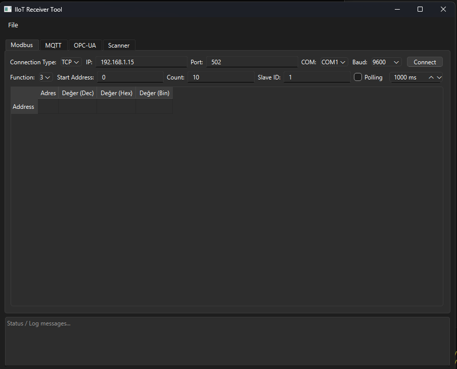
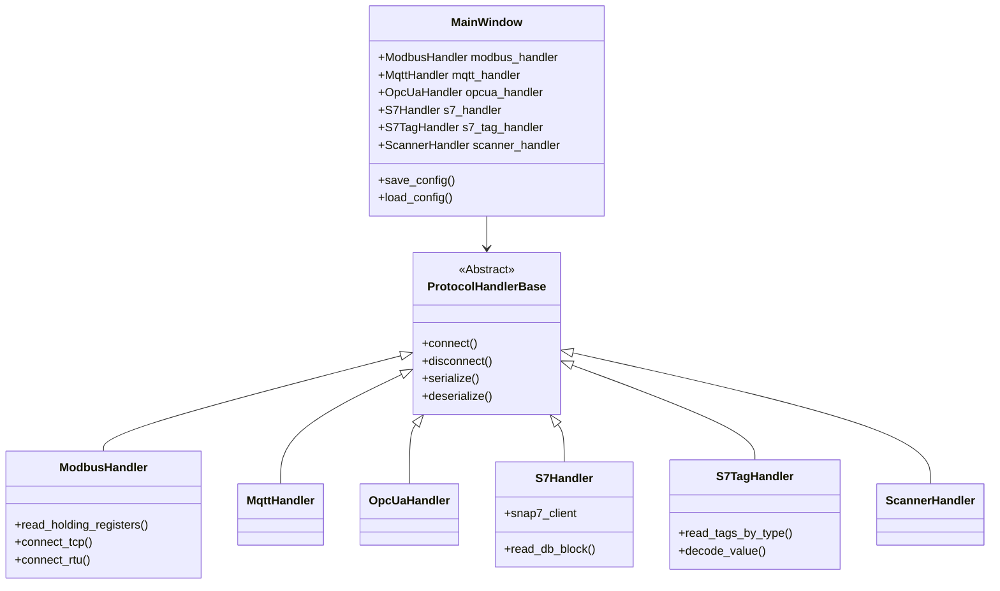
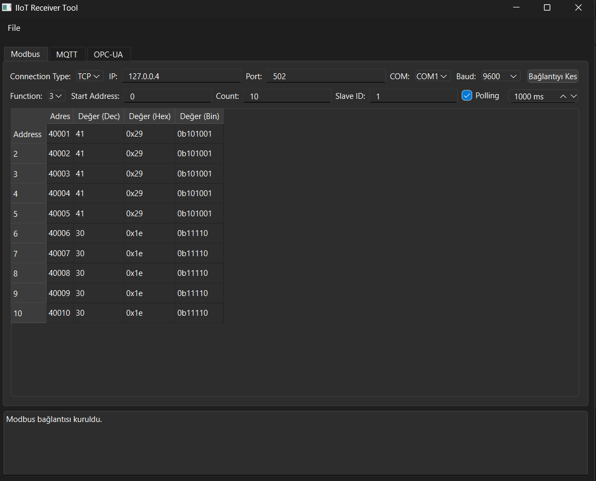
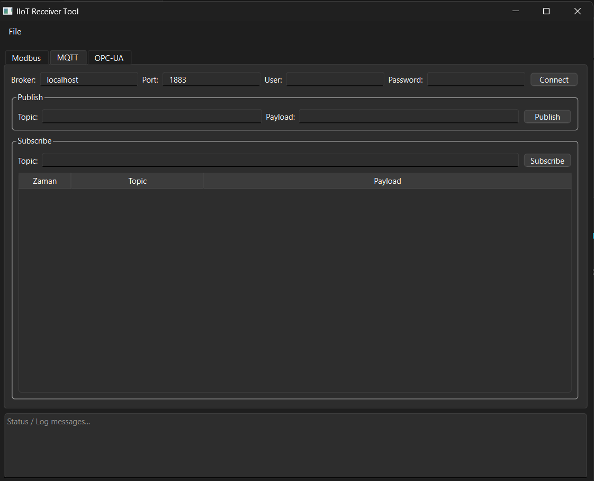
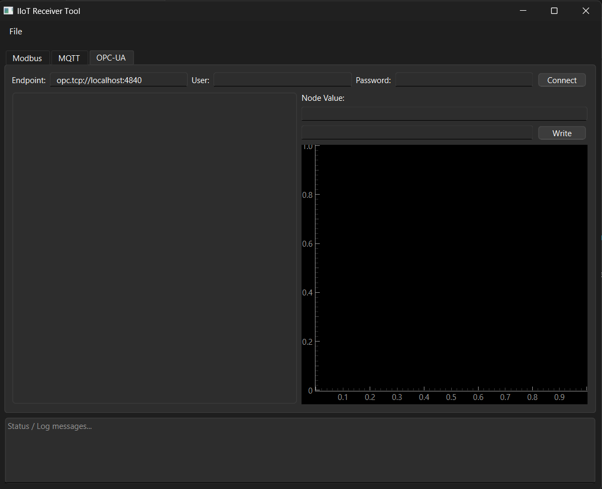
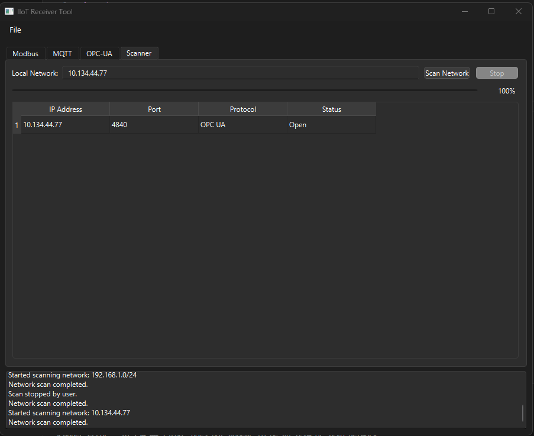

# IIoT Receiver Tool



**IIoT Receiver Tool** is a comprehensive, all-in-one desktop application designed for Industrial IoT engineers and developers. It provides a unified interface to test, monitor, and troubleshoot various industrial communication protocols including **Modbus TCP/RTU**, **MQTT**, **OPC-UA**, and **Siemens S7**.

Built with **Python** and **PyQt6**, it offers a modern, responsive GUI and can be compiled into a standalone executable for easy deployment on field laptops without requiring a Python installation.

---

## 🚀 Features

### 1. Modbus Client (TCP & RTU)
- **Dual Mode**: Support for both Modbus TCP (Ethernet) and Modbus RTU (Serial).
- **Flexible Configuration**: Custom IP, Port, Baud Rate, Parity, Stop Bits.
- **Data Visualization**: View registers in Decimal, Hex, Binary, and Bit-by-Bit formats.
- **Polling**: Automated polling with configurable intervals.

### 2. MQTT Client
- **Pub/Sub**: Publish messages to topics and subscribe to receive real-time updates.
- **Message History**: Log of received messages with timestamps.
- **Authentication**: Support for username/password authentication.

### 3. OPC-UA Client
- **Tree View Browser**: Explore the server's address space visually.
- **Real-time Monitoring**: Subscribe to nodes and view live value updates.
- **Plotting**: Real-time graphing of numeric node values.
- **Security**: Support for various security policies (Basic256Sha256, etc.) and modes (Sign, SignAndEncrypt).
- **Certificate Support**: Load client certificates and private keys.

### 4. Siemens S7 PLC Client
- **Direct Connection**: Connect directly to S7-300/400/1200/1500 PLCs using the Snap7 library.
- **Block Read**: Read entire data blocks (DB) and view raw bytes in Hex and Decimal.
- **Tag Monitor**: Define and monitor specific tags with data type decoding (Bool, Int, Real, DWord, etc.).
- **TIA Portal Compatibility**: Addresses match TIA Portal notation (e.g., `8.0`).

### 5. Network Scanner
- **Discovery**: Scan local networks to find active devices.
- **Port Checking**: Identify open ports relevant to industrial protocols (502, 1883, 4840, 102).

---

## 🛠 Architecture

The application is structured using a modular architecture where each protocol is handled by a dedicated "Handler" class, inheriting from a base protocol class. This ensures separation of concerns and makes it easy to add new protocols in the future.



---

## 📸 Screenshots

|         Modbus TCP/RTU          |         MQTT Client         |
| :-----------------------------: | :-------------------------: |
|  |  |

|         OPC-UA Client          |          Network Scanner          |
| :----------------------------: | :-------------------------------: |
|  |  |

*(Note: S7 Tab screenshots coming soon)*

---

## 📦 Installation & Usage

### Running from Source

1.  **Clone the repository:**
    ```bash
    git clone https://github.com/arslnakin/IIoT-Reciever-Tool.git
    cd IIoT-Reciever-Tool
    ```

2.  **Create a virtual environment:**
    ```bash
    python -m venv .venv
    .venv\Scripts\activate
    ```

3.  **Install dependencies:**
    ```bash
    pip install -r requirements.txt
    ```

4.  **Run the application:**
    ```bash
    python main.py
    ```

### Building Executable (Windows)

To create a standalone `.exe` file that includes all dependencies (including the Snap7 DLL):

```bash
pyinstaller --noconfirm --noconsole --onefile --hidden-import="pyqtgraph" --add-data "mainwindow.ui;." --add-binary ".venv/Lib/site-packages/snap7/lib/snap7.dll;." --name "IIoT-Receiver-Tool" main.py
```

The executable will be located in the `dist/` folder.

---

## 🤝 Contributing

Contributions are welcome! Please fork the repository and submit a Pull Request.

1.  Fork the Project
2.  Create your Feature Branch (`git checkout -b feature/AmazingFeature`)
3.  Commit your Changes (`git commit -m 'Add some AmazingFeature'`)
4.  Push to the Branch (`git push origin feature/AmazingFeature`)
5.  Open a Pull Request

---

## 📄 License

Distributed under the MIT License. See `LICENSE` for more information.