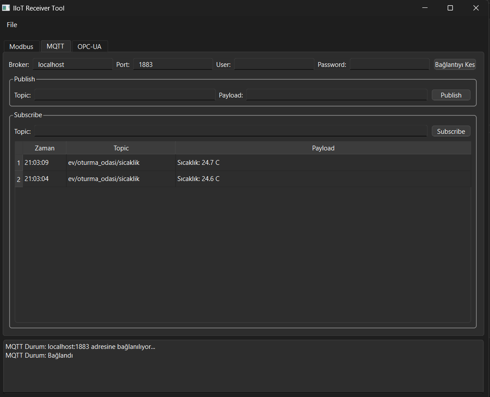
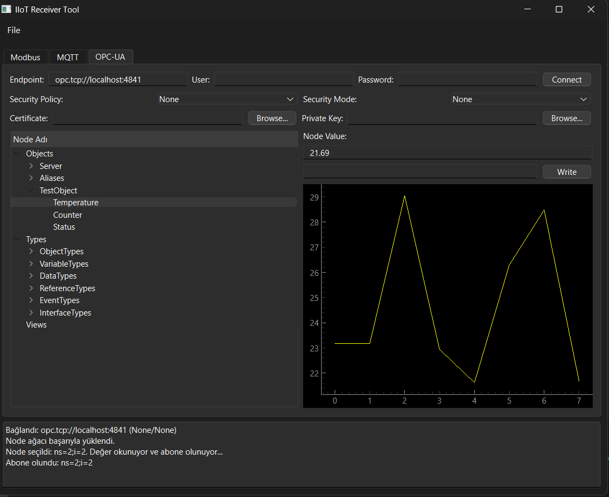

# IIoT Reciever Tool – PyQt6 Modbus / MQTT / OPC-UA Masaüstü Uygulaması

## Genel Bakış

Bu proje, Endüstriyel Nesnelerin İnterneti (IIoT) protokolleri olan Modbus, MQTT ve OPC-UA ile etkileşim kurmak için tasarlanmış bir masaüstü test aracıdır. PyQt6 kullanılarak geliştirilen bu uygulama, kullanıcıların farklı IIoT cihazları ve sistemleriyle kolayca bağlantı kurmasını, veri okumasını, yazmasını ve izlemesini sağlayan sezgisel bir grafik kullanıcı arayüzü (GUI) sunar.

## Özellikler

*   **Modbus TCP/RTU Desteği:**
    *   Coil, Discrete Input, Holding Register ve Input Register okuma/yazma işlemleri.
    *   Birden fazla Modbus cihazına aynı anda bağlanma yeteneği.
    *   Özelleştirilebilir bağlantı ayarları (IP, Port, Unit ID, Baudrate, Parity vb.).
*   **MQTT İstemci:**
    *   MQTT Broker'a bağlanma ve bağlantıyı kesme.
    *   Belirli konulara (topic) abone olma ve mesaj yayınlama.
    *   QoS (Quality of Service) seviyesi ve Retain bayrağı desteği.
    *   Gelen ve giden mesajları görüntüleme.
*   **OPC UA İstemci:**
    *   OPC UA Sunucularına güvenli bağlantı.
    *   Sunucu adres alanını (address space) keşfetme.
    *   Node'ları okuma ve yazma.
    *   Abonelikler aracılığıyla veri değişikliklerini izleme.

## Ekran Görüntüleri

**Modbus Sekmesi**


**MQTT Sekmesi**



**OPC-UA Sekmesi**



## Hızlı Başlangıç

Uygulamayı yerel ortamınızda çalıştırmak için aşağıdaki adımları izleyin:

### Önkoşullar

*   Python 3.8 veya üzeri
*   `pip` (Python paket yöneticisi)

### Kurulum

1.  Projeyi klonlayın:
    ```bash
    git clone https://github.com/arslnakin/IIoT-Reciever-Software.git
    cd IIoT-Reciever-Software
    ```
2.  Bir sanal ortam oluşturun ve etkinleştirin:
    *   **Windows:**
        ```bash
        python -m venv venv
        .\venv\Scripts\activate
        ```
    *   **macOS/Linux:**
        ```bash
        python3 -m venv venv
        source venv/bin/activate
        ```
3.  Gerekli bağımlılıkları yükleyin:
    ```bash
    pip install -r requirements.txt
    ```

### Uygulamayı Çalıştırma

Sanal ortam etkinleştirildikten sonra, uygulamayı aşağıdaki komutla başlatabilirsiniz:

```bash
python main.py
```

## Kullanım

Uygulama başlatıldığında, Modbus, MQTT ve OPC-UA için ayrı sekmeler içeren bir ana pencere göreceksiniz.

*   **Modbus Sekmesi:**
    *   Bağlantı ayarlarını (IP, Port, Unit ID vb.) girin.
    *   "Connect" butonuna tıklayarak bağlantıyı kurun.
    *   İstediğiniz register tipini seçin ve adres aralığını belirterek veri okuma/yazma işlemlerini gerçekleştirin.
*   **MQTT Sekmesi:**
    *   Broker adresini ve portunu girin.
    *   "Connect" butonuna tıklayarak MQTT Broker'a bağlanın.
    *   "Subscribe" alanına konu (topic) girerek abone olun veya "Publish" alanına konu ve mesaj girerek mesaj yayınlayın.
*   **OPC UA Sekmesi:**
    *   OPC UA Sunucu URL'sini girin.
    *   "Connect" butonuna tıklayarak sunucuya bağlanın.
    *   Sunucu adres alanını keşfedin ve istediğiniz Node'ları seçerek okuma/yazma veya abone olma işlemlerini yapın.

## Alternatif Çalıştırma (Windows Executable)

Bu uygulamayı, Python veya diğer bağımlılıkları kurmadan doğrudan bir `.exe` dosyası olarak da çalıştırabilirsiniz. Bu, özellikle test veya dağıtım amaçları için kullanışlıdır.

### Hazır Sürümü Kullanma

1.  Projenin GitHub Releases sayfasından en son `.zip` dosyasını indirin.
2.  İndirdiğiniz arşivi bir klasöre çıkartın.
3.  `IIoT Reciever Tool.exe` dosyasına çift tıklayarak uygulamayı çalıştırın.

### Kendi Executable Dosyanızı Oluşturma (İsteğe Bağlı)

Eğer kodda değişiklik yaptıysanız ve kendi `.exe` dosyanızı oluşturmak isterseniz, aşağıdaki adımları izleyebilirsiniz:

1.  Öncelikle "Hızlı Başlangıç" bölümündeki adımları izleyerek geliştirme ortamını kurun.
2.  Sanal ortam aktifken `pyinstaller` paketini yükleyin:
    ```bash
    pip install pyinstaller
    ```
3.  Projenin ana dizininde aşağıdaki komutu çalıştırarak `.exe` dosyasını oluşturun:
    ```bash
    pyinstaller --name "IIoT Reciever Tool" --onefile --windowed --add-data "mainwindow.ui:." --add-data "imgs:imgs" main.py
    ```
4.  İşlem tamamlandığında, çalıştırılabilir dosyanız `dist` klasörünün içinde `IIoT Reciever Tool.exe` adıyla oluşturulacaktır.

## Test Sunucularını Çalıştırma

Uygulamanın protokol yeteneklerini gerçek cihazlar olmadan test etmek için proje içinde basit test sunucuları bulunmaktadır. Bu sunucuları çalıştırmak için, yeni bir terminal açın ve sanal ortamınızın (`venv`) aktif olduğundan emin olun.

*   **Modbus Test Sunucusu:**
    Basit bir Modbus TCP sunucusu başlatır.
    ```bash
    python tests/modbus_test_server.py
    ```

*   **MQTT Broker:**
    Lokal bir MQTT broker'ı çalıştırır.
    ```bash
    python tests/mqtt_live_server.py
    ```

*   **OPC-UA Test Sunucusu:**
    Örnek değişkenler içeren bir OPC-UA sunucusu başlatır.
    ```bash
    python tests/opcua_test_server.py
    ```

Bu sunucular çalışırken, uygulamadaki varsayılan bağlantı ayarları (örn. `127.0.0.1`, `localhost`) genellikle bu lokal sunuculara bağlanmak için yeterli olacaktır.

## Proje Yapısı

```
IIOT Reciever Software/
├───main.py                 # Ana uygulama dosyası ve GUI mantığı
├───mainwindow.ui           # Qt Designer ile oluşturulan ana pencere UI tanımı
├───requirements.txt        # Python bağımlılıkları
├───protocols/              # Protokol işleyicileri için modüller
│   ├───__init__.py
│   ├───base_handler.py     # Temel protokol işleyici sınıfı
│   ├───modbus_handler.py   # Modbus TCP/RTU işleme mantığı
│   ├───mqtt_handler.py     # MQTT istemci işleme mantığı
│   ├───opc_ua_handler.py   # OPC UA istemci işleme mantığı
│   └───...
├───tests/                  # Test sunucuları ve birim testleri
│   ├───modbus_test_server.py
│   ├───mqtt_live_server.py
│   ├───opcua_test_server.py
│   └───...
├───.venv/                  # Sanal ortam dizini
├───build/                  # PyInstaller build çıktıları
├───dist/                   # PyInstaller dağıtım çıktıları
└───README.md               # Bu README dosyası
```

## Katkıda Bulunma

Katkılarınızı memnuniyetle karşılıyoruz! Bir hata bulursanız veya yeni bir özellik önermek isterseniz, lütfen bir "issue" açın veya bir "pull request" gönderin.

## Lisans

Bu proje MIT Lisansı altında lisanslanmıştır. Daha fazla bilgi için `LICENSE` dosyasına bakın (eğer varsa, yoksa eklenmelidir).
